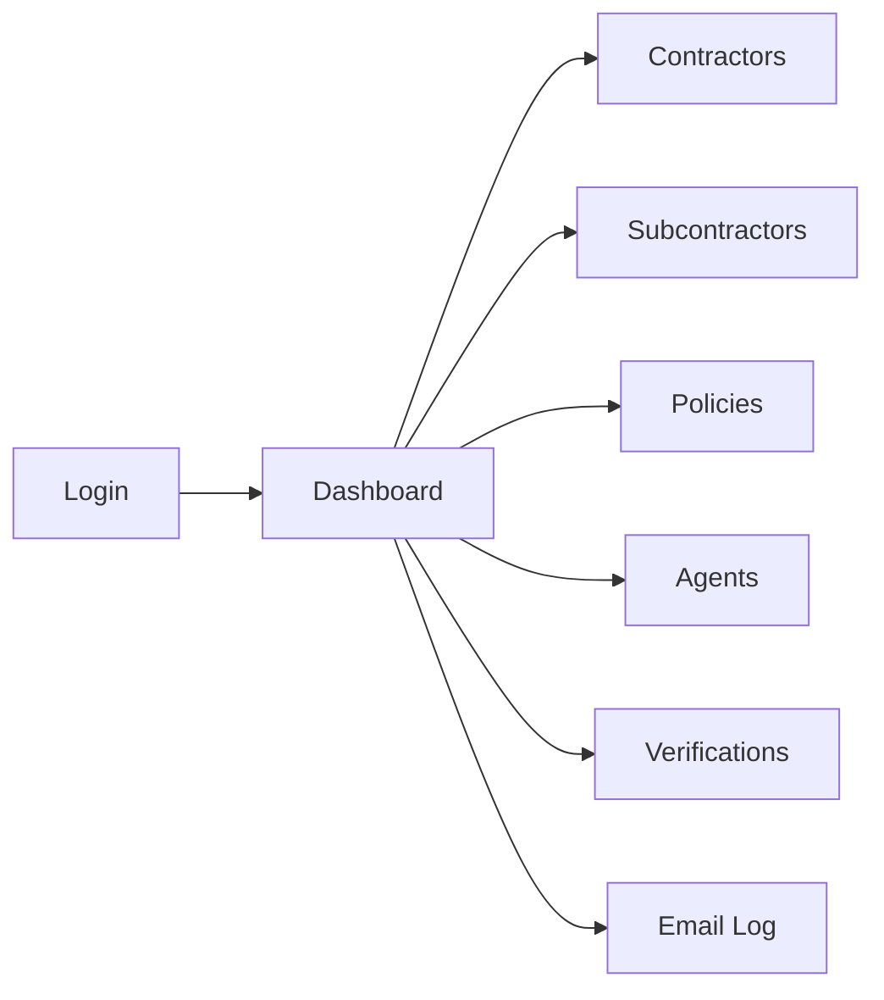

<div align="center">


**Subcontractor Insurance Compliance for Idaho Construction**

</div>

---

## About

CoverVerifi is a compliance verification platform purpose-built for Idaho's construction industry. It replaces the manual phone calls, spreadsheets, and paper filing systems that small general contractors and compliance consultants use today to track subcontractor insurance certificates. With CoverVerifi, consultants can manage multiple GC clients from a single dashboard, monitor policy expirations, trigger agent verification workflows, and maintain a complete audit trail of all compliance activity -- eliminating hours of weekly administrative overhead and reducing coverage gap risk.

---

## Application Routes



---

## Getting Started

### Prerequisites

- **Node.js** 18+
- **npm**

### Install

```bash
npm install
```

### Run (development)

```bash
npm run dev
```

### Build (production)

```bash
npm run build
```

---

## Demo Credentials

| Role | Email | Password |
|------|-------|----------|
| Admin | `dawn@coververifi.com` | `admin123` |
| GC | `mike@treasurevalley.com` | `gc123` |

---

## Tech Stack

| Technology | Version | Purpose |
|------------|---------|---------|
| React | 18 | UI framework |
| Vite | 6 | Build tool and dev server |
| React Router | 6 | Client-side routing |
| TailwindCSS | 4 | Utility-first CSS |
| Lucide React | -- | Icon library |

---

## Project Structure

```
coververifi/
├── public/
├── src/
│   ├── assets/
│   ├── components/
│   │   ├── layout/
│   │   │   └── MainLayout.jsx
│   │   └── shared/
│   │       ├── Toast.jsx
│   │       ├── Modal.jsx
│   │       ├── DataTable.jsx
│   │       ├── StatusBadge.jsx
│   │       └── StatsCard.jsx
│   ├── contexts/
│   │   ├── AuthContext.jsx
│   │   └── DataContext.jsx
│   ├── data/
│   │   └── mockData.js
│   ├── pages/
│   │   ├── Login.jsx
│   │   ├── Dashboard.jsx
│   │   ├── Contractors.jsx
│   │   ├── Subcontractors.jsx
│   │   ├── Policies.jsx
│   │   ├── Agents.jsx
│   │   ├── Verifications.jsx
│   │   └── EmailLog.jsx
│   ├── utils/
│   │   ├── formatters.js
│   │   └── validators.js
│   ├── App.jsx
│   ├── main.jsx
│   └── index.css
├── supabase/
│   └── schema-stub.sql
├── vercel.json
├── vite.config.js
├── package.json
└── index.html
```

---

## Environment Variables

These variables are reserved for future backend integration. The app currently runs with mock data and does not require them.

| Variable | Description |
|----------|-------------|
| `VITE_SUPABASE_URL` | Supabase project URL |
| `VITE_SUPABASE_ANON_KEY` | Supabase anonymous/public key |
| `VITE_RESEND_API_KEY` | Resend API key for transactional email |

Create a `.env.local` file in the project root:

```env
VITE_SUPABASE_URL=https://your-project.supabase.co
VITE_SUPABASE_ANON_KEY=your-anon-key
VITE_RESEND_API_KEY=your-resend-key
```

---

## Deployment

CoverVerifi is configured for deployment on **Vercel**.

| Setting | Value |
|---------|-------|
| Build command | `npm run build` |
| Output directory | `dist` |
| SPA rewrites | Configured in `vercel.json` |

The `vercel.json` file includes a catch-all rewrite rule so that all routes resolve to `index.html`, enabling client-side routing:

```json
{
  "rewrites": [
    { "source": "/(.*)", "destination": "/index.html" }
  ]
}
```

---

## Available Scripts

| Script | Command | Description |
|--------|---------|-------------|
| dev | `npm run dev` | Start the Vite development server |
| build | `npm run build` | Create a production build in `dist/` |
| preview | `npm run preview` | Serve the production build locally |

---

## Contributing

Contributions are not currently open. This is a proprietary product in active MVP development. If you are interested in contributing or partnering, please reach out to Acentra Labs.

---

## License

Proprietary. All rights reserved.

---

<div align="center">

Built by **[Acentra Labs](https://acentralabs.com)**

</div>
