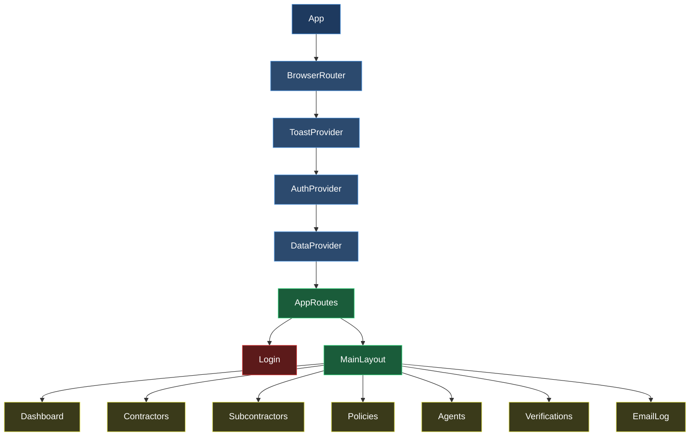
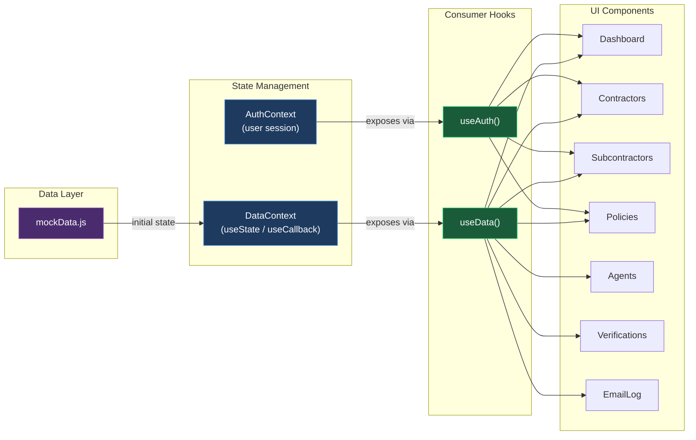
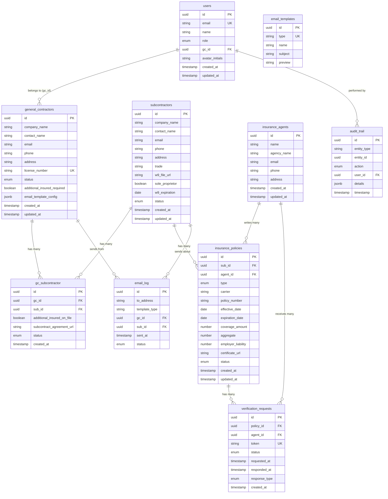

# CoverVerifi -- Technical Documentation

**Subcontractor Insurance Compliance Platform for Idaho Construction**

Version: 1.0.0 (MVP)
Last Updated: 2026-04-10

---

## Table of Contents

1. [Architecture Overview](#1-architecture-overview)
2. [Data Flow Diagram](#2-data-flow-diagram)
3. [Frontend Architecture](#3-frontend-architecture)
4. [Data Model Documentation](#4-data-model-documentation)
5. [Entity-Relationship Diagram](#5-entity-relationship-diagram)
6. [Supabase Migration Plan](#6-supabase-migration-plan)
7. [API Integration Points](#7-api-integration-points)
8. [Third-Party Dependencies](#8-third-party-dependencies)
9. [Performance Considerations](#9-performance-considerations)
10. [Security Considerations](#10-security-considerations)
11. [Future Architecture](#11-future-architecture)

---

## 1. Architecture Overview

CoverVerifi is a single-page application built with React 18 and Vite 6. The MVP runs entirely on the client with mock data, designed for a seamless cutover to a Supabase backend. The component hierarchy follows a provider-wrapping pattern that makes auth state, domain data, and UI notifications available throughout the tree.



**Layer responsibilities:**

| Layer | Purpose |
|---|---|
| `App` | Root component, mounts the React tree |
| `BrowserRouter` | Enables client-side routing via React Router v6 |
| `ToastProvider` | Global toast notification queue and rendering |
| `AuthProvider` | Manages user session, login/logout, role-based access |
| `DataProvider` | Centralizes all domain data (contractors, policies, etc.) and CRUD operations |
| `AppRoutes` | Declares route definitions, applies `ProtectedRoute` guards |
| `MainLayout` | Persistent shell: sidebar navigation, header with notifications, footer |
| Page Components | Individual feature views consuming data via `useData()` hook |

---

## 2. Data Flow Diagram

All domain state in the MVP originates from `mockData.js` and is managed through React Context. When the Supabase backend is connected, the `DataContext` provider internals change but the consumer API (`useData()` hook) remains identical.



**State management pattern:**

- `DataContext` initializes state from `mockData.js` using `useState`.
- CRUD operations are defined with `useCallback` to maintain referential stability and prevent unnecessary re-renders.
- `AuthContext` manages user sessions independently: current user object, login/logout functions, and role metadata.
- Components never import `mockData.js` directly. All reads and writes go through the `useData()` hook, ensuring a single migration point when Supabase replaces mock data.

---

## 3. Frontend Architecture

### 3.1 Routing

React Router v6 with nested routes. All authenticated routes are wrapped in a `ProtectedRoute` component that checks `AuthContext` for a valid session.

```
/                       -> Redirect to /dashboard (if authed) or /login
/login                  -> Login (public)
/dashboard              -> Dashboard (protected)
/contractors            -> Contractors list (protected)
/contractors/:id        -> Contractor detail (protected)
/subcontractors         -> Subcontractors list (protected)
/subcontractors/:id     -> Subcontractor detail (protected)
/policies               -> Policies list (protected)
/policies/:id           -> Policy detail (protected)
/agents                 -> Insurance Agents list (protected)
/agents/:id             -> Agent detail (protected)
/verifications          -> Verification Requests (protected)
/verifications/:id      -> Verification detail (protected)
/email-log              -> Email Log (protected, adminOnly)
/settings               -> Settings (protected, adminOnly)
```

**ProtectedRoute logic:**

```jsx
// Pseudocode
function ProtectedRoute({ children, adminOnly = false }) {
  const { user, isAuthenticated } = useAuth();
  if (!isAuthenticated) return <Navigate to="/login" />;
  if (adminOnly && user.role !== 'admin') return <Navigate to="/dashboard" />;
  return children;
}
```

The `adminOnly` flag restricts routes like `/email-log` and `/settings` to users with `role === 'admin'`. Standard GC users are redirected to `/dashboard` if they attempt to access admin routes.

### 3.2 State Management

Two React Contexts provide all application state:

**AuthContext**

| Export | Type | Purpose |
|---|---|---|
| `user` | Object / null | Current authenticated user |
| `isAuthenticated` | boolean | Whether a session exists |
| `login(email, password)` | async function | Authenticates and sets user |
| `logout()` | function | Clears session |
| `isAdmin` | boolean | Convenience flag for role check |

**DataContext**

| Export | Type | Purpose |
|---|---|---|
| `contractors` | Array | All general contractors |
| `subcontractors` | Array | All subcontractors |
| `policies` | Array | All insurance policies |
| `agents` | Array | All insurance agents |
| `verifications` | Array | All verification requests |
| `emailLog` | Array | All sent email records |
| `auditTrail` | Array | All audit log entries |
| `addContractor(data)` | function | Creates a new GC record |
| `updateContractor(id, data)` | function | Updates an existing GC |
| `deleteContractor(id)` | function | Removes a GC record |
| `addSubcontractor(data)` | function | Creates a new sub record |
| `updateSubcontractor(id, data)` | function | Updates an existing sub |
| `deleteSubcontractor(id)` | function | Removes a sub record |
| `addPolicy(data)` | function | Creates a new policy |
| `updatePolicy(id, data)` | function | Updates an existing policy |
| `addVerification(data)` | function | Creates a verification request |
| `updateVerification(id, data)` | function | Updates a verification |
| `getStats()` | function | Computes dashboard statistics |
| `getExpiringPolicies(days)` | function | Returns policies expiring within N days |

### 3.3 Layout

`MainLayout` provides the application shell for all authenticated pages:

```
+----------------------------------------------------------+
|  Header (logo, search, notifications bell, user avatar)  |
+----------+-----------------------------------------------+
|          |                                               |
| Sidebar  |              Page Content                     |
| Nav      |              (Outlet)                         |
|          |                                               |
|  - Dash  |                                               |
|  - GCs   |                                               |
|  - Subs  |                                               |
|  - Pols  |                                               |
|  - Agts  |                                               |
|  - Vrfy  |                                               |
|  - Email |                                               |
|          |                                               |
+----------+-----------------------------------------------+
|  Footer (copyright, version)                             |
+----------------------------------------------------------+
```

- The sidebar collapses to an icon-only rail on screens below `lg` breakpoint (1024px).
- On mobile (`< 768px`), the sidebar becomes a slide-out drawer triggered by a hamburger menu.
- Active route is highlighted in the sidebar using `NavLink` from React Router.
- The header notification bell shows a count badge for pending verification requests and expiring policies.

### 3.4 Shared Components

**DataTable**

A reusable table component used across all list views.

| Prop | Type | Description |
|---|---|---|
| `columns` | Array<{ key, label, sortable?, render? }> | Column definitions |
| `data` | Array | Row data |
| `searchable` | boolean | Enables search input |
| `searchKeys` | Array<string> | Fields to search against |
| `onRowClick` | function | Row click handler |
| `actions` | Array<{ label, icon, onClick }> | Row action buttons |
| `pagination` | boolean | Enables client-side pagination |
| `pageSize` | number | Rows per page (default: 10) |

Features: column sorting (asc/desc toggle), full-text search across specified fields, client-side pagination, optional row actions column with icon buttons.

**Modal**

Generic modal dialog for forms and confirmations.

| Prop | Type | Description |
|---|---|---|
| `isOpen` | boolean | Visibility state |
| `onClose` | function | Close handler |
| `title` | string | Modal header text |
| `size` | 'sm' / 'md' / 'lg' | Width preset |
| `children` | ReactNode | Modal body content |

**Toast Notifications**

Managed by `ToastProvider` at the top of the component tree.

| Function | Parameters | Description |
|---|---|---|
| `toast.success(message)` | string | Green success notification |
| `toast.error(message)` | string | Red error notification |
| `toast.warning(message)` | string | Yellow warning notification |
| `toast.info(message)` | string | Blue informational notification |

Toasts auto-dismiss after 5 seconds. Stacked in the bottom-right corner with enter/exit animations.

**StatusBadge**

Renders a colored pill badge based on entity status.

| Status Value | Color | Used For |
|---|---|---|
| `active` | Green | Contractors, subcontractors, policies |
| `inactive` | Gray | Contractors, subcontractors |
| `expired` | Red | Policies |
| `expiring_soon` | Yellow | Policies (within 30 days) |
| `pending` | Blue | Verification requests |
| `verified` | Green | Verification requests |
| `rejected` | Red | Verification requests |

**StatsCard**

Dashboard summary card displaying a metric with icon, value, label, and optional trend indicator.

| Prop | Type | Description |
|---|---|---|
| `title` | string | Metric label |
| `value` | number / string | Primary display value |
| `icon` | LucideIcon | Icon component |
| `trend` | number / null | Percentage change (green if positive, red if negative) |
| `color` | string | Accent color class |

---

## 4. Data Model Documentation

All entities listed below map 1:1 to Supabase tables in the migration plan. The MVP stores them as arrays in `mockData.js`. Field types use TypeScript-style annotations for clarity.

### 4.1 `users`

Represents application users (GC admins, staff, platform admins).

| Field | Type | Constraints | Description |
|---|---|---|---|
| `id` | `string (UUID)` | PK | Unique identifier |
| `email` | `string` | UNIQUE, NOT NULL | Login email |
| `name` | `string` | NOT NULL | Display name |
| `role` | `enum('admin','gc_admin','gc_user')` | NOT NULL | Access role |
| `gc_id` | `string (UUID) \| null` | FK -> general_contractors.id | Associated GC (null for platform admins) |
| `avatar_initials` | `string` | NOT NULL | 2-letter initials for avatar display |
| `created_at` | `timestamp` | NOT NULL, DEFAULT now() | Record creation time |
| `updated_at` | `timestamp` | NOT NULL, DEFAULT now() | Last modification time |

### 4.2 `general_contractors`

General contractor companies that manage subcontractors.

| Field | Type | Constraints | Description |
|---|---|---|---|
| `id` | `string (UUID)` | PK | Unique identifier |
| `company_name` | `string` | NOT NULL | Legal business name |
| `contact_name` | `string` | NOT NULL | Primary contact person |
| `email` | `string` | NOT NULL | Primary contact email |
| `phone` | `string` | | Contact phone number |
| `address` | `string` | | Business address |
| `license_number` | `string` | UNIQUE | Idaho contractor license number |
| `status` | `enum('active','inactive')` | NOT NULL, DEFAULT 'active' | Account status |
| `additional_insured_required` | `boolean` | DEFAULT true | Whether subs must list GC as additional insured |
| `email_template_config` | `jsonb` | | Custom email template settings |
| `created_at` | `timestamp` | NOT NULL, DEFAULT now() | Record creation time |
| `updated_at` | `timestamp` | NOT NULL, DEFAULT now() | Last modification time |

### 4.3 `subcontractors`

Subcontractor companies whose insurance is tracked.

| Field | Type | Constraints | Description |
|---|---|---|---|
| `id` | `string (UUID)` | PK | Unique identifier |
| `company_name` | `string` | NOT NULL | Legal business name |
| `contact_name` | `string` | NOT NULL | Primary contact person |
| `email` | `string` | NOT NULL | Primary contact email |
| `phone` | `string` | | Contact phone number |
| `address` | `string` | | Business address |
| `trade` | `string` | NOT NULL | Trade specialty (e.g., Electrical, Plumbing, HVAC) |
| `w9_file_url` | `string \| null` | | URL to uploaded W-9 document in Supabase Storage |
| `sole_proprietor` | `boolean` | DEFAULT false | Whether sub is a sole proprietor |
| `w9_expiration` | `date \| null` | | W-9 expiration date |
| `status` | `enum('active','inactive')` | NOT NULL, DEFAULT 'active' | Account status |
| `created_at` | `timestamp` | NOT NULL, DEFAULT now() | Record creation time |
| `updated_at` | `timestamp` | NOT NULL, DEFAULT now() | Last modification time |

### 4.4 `gc_subcontractor`

Join table linking general contractors to their subcontractors (many-to-many).

| Field | Type | Constraints | Description |
|---|---|---|---|
| `id` | `string (UUID)` | PK | Unique identifier |
| `gc_id` | `string (UUID)` | FK -> general_contractors.id, NOT NULL | General contractor reference |
| `sub_id` | `string (UUID)` | FK -> subcontractors.id, NOT NULL | Subcontractor reference |
| `additional_insured_on_file` | `boolean` | DEFAULT false | Whether additional insured cert is on file |
| `subcontract_agreement_url` | `string \| null` | | URL to signed subcontract agreement |
| `status` | `enum('active','inactive','pending')` | DEFAULT 'pending' | Relationship status |
| `created_at` | `timestamp` | NOT NULL, DEFAULT now() | Record creation time |

UNIQUE constraint on `(gc_id, sub_id)`.

### 4.5 `insurance_agents`

Insurance agents/agencies associated with subcontractor policies.

| Field | Type | Constraints | Description |
|---|---|---|---|
| `id` | `string (UUID)` | PK | Unique identifier |
| `name` | `string` | NOT NULL | Agent name |
| `agency_name` | `string` | NOT NULL | Agency/company name |
| `email` | `string` | NOT NULL | Agent email |
| `phone` | `string` | | Agent phone number |
| `address` | `string` | | Agency address |
| `created_at` | `timestamp` | NOT NULL, DEFAULT now() | Record creation time |
| `updated_at` | `timestamp` | NOT NULL, DEFAULT now() | Last modification time |

### 4.6 `insurance_policies`

Insurance policies held by subcontractors.

| Field | Type | Constraints | Description |
|---|---|---|---|
| `id` | `string (UUID)` | PK | Unique identifier |
| `sub_id` | `string (UUID)` | FK -> subcontractors.id, NOT NULL | Subcontractor who holds this policy |
| `agent_id` | `string (UUID)` | FK -> insurance_agents.id, NOT NULL | Issuing agent |
| `type` | `enum('WC','GL')` | NOT NULL | Policy type: Workers' Compensation or General Liability |
| `carrier` | `string` | NOT NULL | Insurance carrier name |
| `policy_number` | `string` | NOT NULL | Carrier-assigned policy number |
| `effective_date` | `date` | NOT NULL | Policy start date |
| `expiration_date` | `date` | NOT NULL | Policy end date |
| `coverage_amount` | `number` | NOT NULL | Per-occurrence coverage limit (in USD) |
| `aggregate` | `number \| null` | | General aggregate limit (GL policies) |
| `employer_liability` | `number \| null` | | Employer liability limit (WC policies) |
| `certificate_url` | `string \| null` | | URL to uploaded certificate of insurance |
| `status` | `enum('active','expired','expiring_soon','pending')` | NOT NULL | Computed policy status |
| `created_at` | `timestamp` | NOT NULL, DEFAULT now() | Record creation time |
| `updated_at` | `timestamp` | NOT NULL, DEFAULT now() | Last modification time |

### 4.7 `verification_requests`

Requests sent to insurance agents to verify policy authenticity.

| Field | Type | Constraints | Description |
|---|---|---|---|
| `id` | `string (UUID)` | PK | Unique identifier |
| `policy_id` | `string (UUID)` | FK -> insurance_policies.id, NOT NULL | Policy being verified |
| `agent_id` | `string (UUID)` | FK -> insurance_agents.id, NOT NULL | Agent being asked to verify |
| `token` | `string` | UNIQUE, NOT NULL | Secure token for agent verification link |
| `status` | `enum('pending','verified','rejected','expired')` | NOT NULL, DEFAULT 'pending' | Verification status |
| `requested_at` | `timestamp` | NOT NULL, DEFAULT now() | When the request was sent |
| `responded_at` | `timestamp \| null` | | When the agent responded |
| `response_type` | `enum('email','portal') \| null` | | How the agent responded |
| `created_at` | `timestamp` | NOT NULL, DEFAULT now() | Record creation time |

### 4.8 `email_log`

Record of all emails sent through the system.

| Field | Type | Constraints | Description |
|---|---|---|---|
| `id` | `string (UUID)` | PK | Unique identifier |
| `to` | `string` | NOT NULL | Recipient email address |
| `template_type` | `string` | NOT NULL | Email template identifier (e.g., 'verification_request', 'expiration_warning') |
| `gc_id` | `string (UUID) \| null` | FK -> general_contractors.id | Associated GC |
| `sub_id` | `string (UUID) \| null` | FK -> subcontractors.id | Associated subcontractor |
| `sent_at` | `timestamp` | NOT NULL, DEFAULT now() | When the email was sent |
| `status` | `enum('sent','delivered','bounced','failed')` | NOT NULL, DEFAULT 'sent' | Delivery status |

### 4.9 `audit_trail`

Immutable log of all data changes for compliance tracking.

| Field | Type | Constraints | Description |
|---|---|---|---|
| `id` | `string (UUID)` | PK | Unique identifier |
| `entity_type` | `string` | NOT NULL | Table name of the changed entity |
| `entity_id` | `string (UUID)` | NOT NULL | ID of the changed record |
| `action` | `enum('create','update','delete')` | NOT NULL | Type of change |
| `user_id` | `string (UUID)` | FK -> users.id, NOT NULL | User who made the change |
| `details` | `jsonb` | | Diff or snapshot of changes |
| `timestamp` | `timestamp` | NOT NULL, DEFAULT now() | When the change occurred |

### 4.10 `email_templates`

Configurable email templates for system-generated messages.

| Field | Type | Constraints | Description |
|---|---|---|---|
| `id` | `string (UUID)` | PK | Unique identifier |
| `type` | `string` | UNIQUE, NOT NULL | Template key (e.g., 'verification_request') |
| `name` | `string` | NOT NULL | Human-readable template name |
| `subject` | `string` | NOT NULL | Email subject line (supports variable interpolation) |
| `preview` | `string` | | Preview text for email template management UI |

### 4.11 `compliance_defaults`

Idaho-specific insurance compliance thresholds and requirements.

| Field | Type | Description |
|---|---|---|
| `gl_min_coverage` | `number` | Minimum General Liability per-occurrence limit (Idaho default: $1,000,000) |
| `gl_min_aggregate` | `number` | Minimum GL aggregate limit (Idaho default: $2,000,000) |
| `wc_required` | `boolean` | Whether Workers' Comp is required (Idaho: true for 1+ employees) |
| `wc_min_employer_liability` | `number` | Minimum employer liability limit (Idaho default: $500,000) |
| `expiration_warning_days` | `number` | Days before expiration to trigger warnings (default: 30) |
| `expiration_critical_days` | `number` | Days before expiration for critical alerts (default: 14) |
| `w9_required` | `boolean` | Whether W-9 is required for all subcontractors (default: true) |
| `additional_insured_required` | `boolean` | Whether GC must be listed as additional insured (default: true) |
| `sole_proprietor_wc_exempt` | `boolean` | Whether sole proprietors are exempt from WC in Idaho (default: true) |

---

## 5. Entity-Relationship Diagram



**Key relationships:**

- A **general contractor** has many **subcontractors** through the `gc_subcontractor` join table (many-to-many). A single subcontractor can work with multiple GCs.
- A **subcontractor** has many **insurance policies**. Each policy has exactly one **insurance agent**.
- A **verification request** links one **policy** to one **agent** and tracks the agent's response.
- The **email log** records communications related to a GC-subcontractor pair.
- The **audit trail** records which **user** performed every data mutation.

---

## 6. Supabase Migration Plan

The MVP mock data layer is structured to map directly to 13 Supabase tables. Migration involves replacing the in-memory arrays and `useCallback` CRUD functions with Supabase client calls.

### 6.1 Table Mapping

| Mock Data Array | Supabase Table | Notes |
|---|---|---|
| `mockUsers` | `users` | Linked to Supabase Auth via `auth.users.id` |
| `mockContractors` | `general_contractors` | |
| `mockSubcontractors` | `subcontractors` | |
| `mockGcSubs` | `gc_subcontractor` | Join table with composite unique on (gc_id, sub_id) |
| `mockAgents` | `insurance_agents` | |
| `mockPolicies` | `insurance_policies` | Status computed via DB trigger or view |
| `mockVerifications` | `verification_requests` | Token generated server-side |
| `mockEmailLog` | `email_log` | Written by Edge Functions, read-only in UI |
| `mockAuditTrail` | `audit_trail` | Written by DB triggers, read-only in UI |
| `mockTemplates` | `email_templates` | Seeded, admin-editable |
| `complianceDefaults` | `compliance_defaults` | Single-row config table |
| -- | `storage.w9_documents` | Supabase Storage bucket |
| -- | `storage.certificates` | Supabase Storage bucket |

### 6.2 Row-Level Security (RLS) Policies

RLS ensures each GC only sees their own data. Every table with a `gc_id` column (directly or via join) gets RLS policies.

```sql
-- Example: subcontractors visible only through gc_subcontractor join
CREATE POLICY "GC can view their subcontractors"
ON subcontractors FOR SELECT
USING (
  id IN (
    SELECT sub_id FROM gc_subcontractor
    WHERE gc_id = (
      SELECT gc_id FROM users WHERE id = auth.uid()
    )
  )
);

-- Example: users can only see their own GC's data
CREATE POLICY "Users see own GC contractors"
ON general_contractors FOR SELECT
USING (
  id = (SELECT gc_id FROM users WHERE id = auth.uid())
);

-- Platform admins bypass RLS
CREATE POLICY "Admins see all"
ON general_contractors FOR ALL
USING (
  EXISTS (
    SELECT 1 FROM users
    WHERE id = auth.uid() AND role = 'admin'
  )
);
```

Tables and their RLS strategy:

| Table | RLS Strategy |
|---|---|
| `users` | User sees own record; admin sees all |
| `general_contractors` | User sees own GC; admin sees all |
| `subcontractors` | User sees subs linked to own GC via `gc_subcontractor`; admin sees all |
| `gc_subcontractor` | User sees rows where `gc_id` matches own GC; admin sees all |
| `insurance_policies` | User sees policies for subs linked to own GC; admin sees all |
| `insurance_agents` | User sees agents tied to own GC's policies; admin sees all |
| `verification_requests` | User sees verifications for own GC's policies; admin sees all |
| `email_log` | User sees emails for own GC; admin sees all |
| `audit_trail` | Admin only |
| `email_templates` | Read: all authenticated; Write: admin only |
| `compliance_defaults` | Read: all authenticated; Write: admin only |

### 6.3 Authentication

- Supabase Auth replaces the mock `AuthContext` login flow.
- Email/password sign-in for GC users.
- Magic link option for insurance agents responding to verification requests.
- JWT includes `user_metadata.gc_id` and `user_metadata.role` for RLS.
- Session refresh handled by `supabase-js` client automatically.

### 6.4 File Storage

Two Supabase Storage buckets:

| Bucket | Access | Contents |
|---|---|---|
| `w9-documents` | Private (RLS-gated) | W-9 forms uploaded by subcontractors |
| `certificates` | Private (RLS-gated) | Certificates of insurance (COI) |

Files are named using the pattern `{gc_id}/{sub_id}/{filename}` to enable path-based RLS policies. Signed URLs are generated server-side with a short TTL for viewing.

---

## 7. API Integration Points

Every location where the frontend currently reads from `mockData.js` or mutates in-memory state is an integration point for the Supabase backend.

### 7.1 Authentication

| Frontend Action | Current (Mock) | Supabase Target |
|---|---|---|
| Login | Compare against `mockUsers` array | `supabase.auth.signInWithPassword()` |
| Logout | Clear context state | `supabase.auth.signOut()` |
| Get current user | Read from `AuthContext` | `supabase.auth.getUser()` |
| Session refresh | N/A (always "logged in") | `supabase.auth.onAuthStateChange()` |

### 7.2 CRUD Operations

| Entity | Operation | Current (Mock) | Supabase Target |
|---|---|---|---|
| General Contractors | Read all | `mockContractors` filter | `supabase.from('general_contractors').select()` |
| General Contractors | Create | Push to array | `supabase.from('general_contractors').insert()` |
| General Contractors | Update | Find and merge | `supabase.from('general_contractors').update().eq('id', id)` |
| General Contractors | Delete | Filter out | `supabase.from('general_contractors').delete().eq('id', id)` |
| Subcontractors | Read all | `mockSubcontractors` filter | `supabase.from('subcontractors').select()` joined via `gc_subcontractor` |
| Subcontractors | Create | Push to array | `supabase.from('subcontractors').insert()` + `gc_subcontractor` link |
| Subcontractors | Update | Find and merge | `supabase.from('subcontractors').update().eq('id', id)` |
| Subcontractors | Delete | Filter out | `supabase.from('subcontractors').delete().eq('id', id)` |
| Insurance Policies | Read all | `mockPolicies` filter | `supabase.from('insurance_policies').select('*, subcontractors(*), insurance_agents(*)')` |
| Insurance Policies | Create | Push to array | `supabase.from('insurance_policies').insert()` |
| Insurance Policies | Update | Find and merge | `supabase.from('insurance_policies').update().eq('id', id)` |
| Insurance Agents | Read all | `mockAgents` filter | `supabase.from('insurance_agents').select()` |
| Insurance Agents | Create | Push to array | `supabase.from('insurance_agents').insert()` |
| Insurance Agents | Update | Find and merge | `supabase.from('insurance_agents').update().eq('id', id)` |
| Verifications | Read all | `mockVerifications` filter | `supabase.from('verification_requests').select('*, insurance_policies(*), insurance_agents(*)')` |
| Verifications | Create | Push to array | `supabase.from('verification_requests').insert()` |
| Verifications | Update | Find and merge | `supabase.from('verification_requests').update().eq('id', id)` |
| Email Log | Read all | `mockEmailLog` filter | `supabase.from('email_log').select()` |
| Audit Trail | Read all | `mockAuditTrail` filter | `supabase.from('audit_trail').select()` |

### 7.3 File Uploads

| Action | Current (Mock) | Supabase Target |
|---|---|---|
| Upload W-9 | Simulated, stores fake URL | `supabase.storage.from('w9-documents').upload(path, file)` |
| Upload Certificate | Simulated, stores fake URL | `supabase.storage.from('certificates').upload(path, file)` |
| View W-9 | Opens mock URL | `supabase.storage.from('w9-documents').createSignedUrl(path, 3600)` |
| View Certificate | Opens mock URL | `supabase.storage.from('certificates').createSignedUrl(path, 3600)` |

### 7.4 Email Sending

| Action | Current (Mock) | Supabase Target |
|---|---|---|
| Send verification request email | Adds to `mockEmailLog` | Supabase Edge Function -> Resend API |
| Send expiration warning | Adds to `mockEmailLog` | Supabase Edge Function -> Resend API |
| Send W-9 request | Adds to `mockEmailLog` | Supabase Edge Function -> Resend API |

Edge Function pattern:

```typescript
// supabase/functions/send-email/index.ts
import { Resend } from 'resend';

const resend = new Resend(Deno.env.get('RESEND_API_KEY'));

Deno.serve(async (req) => {
  const { to, template_type, variables } = await req.json();
  // Fetch template from email_templates table
  // Interpolate variables
  // Send via Resend
  // Log to email_log table
});
```

### 7.5 Scheduled Jobs

| Job | Frequency | Supabase Target |
|---|---|---|
| Check policy expirations | Daily at 06:00 MT | Supabase CRON -> Edge Function |
| Send expiration warnings | Daily at 07:00 MT | Supabase CRON -> Edge Function -> Resend |
| Expire stale verification tokens | Hourly | Supabase CRON -> SQL function |
| Update policy statuses | Daily at 00:00 MT | Supabase CRON -> SQL function |

CRON setup via `supabase/migrations`:

```sql
SELECT cron.schedule(
  'check-policy-expirations',
  '0 6 * * *',
  $$SELECT net.http_post(
    url := 'https://<project>.supabase.co/functions/v1/check-expirations',
    headers := '{"Authorization": "Bearer <service_role_key>"}'::jsonb
  )$$
);
```

---

## 8. Third-Party Dependencies

### 8.1 Production Dependencies

| Package | Version | Purpose |
|---|---|---|
| `react` | ^18.x | UI component library |
| `react-dom` | ^18.x | React DOM renderer |
| `react-router-dom` | ^6.x | Client-side routing with nested routes |
| `lucide-react` | ^0.4x | Icon library (tree-shakeable SVG icons) |

### 8.2 Development Dependencies

| Package | Version | Purpose |
|---|---|---|
| `vite` | ^6.x | Build tool and dev server (ESM-native, HMR) |
| `@vitejs/plugin-react` | ^4.x | React Fast Refresh and JSX transform for Vite |
| `tailwindcss` | ^4.x | Utility-first CSS framework |
| `@tailwindcss/vite` | ^4.x | Vite plugin for TailwindCSS v4 (replaces PostCSS config) |

### 8.3 Dependency Notes

- **No state management library** (Redux, Zustand, etc.). React Context with `useState`/`useCallback` is sufficient for the MVP data volume.
- **No form library** (React Hook Form, Formik). Forms use controlled components with local state.
- **No HTTP client** (Axios). When Supabase is integrated, `supabase-js` handles all API calls.
- **No testing framework yet**. Vitest is the recommended addition for unit/integration tests.
- **TailwindCSS v4** uses the new CSS-first configuration (no `tailwind.config.js`). Configuration is done via `@theme` directives in `src/index.css`.

---

## 9. Performance Considerations

### 9.1 Code Splitting

The MVP bundles all pages into a single chunk. For production with Supabase:

```jsx
// Lazy-load page components
const Dashboard = lazy(() => import('./pages/Dashboard'));
const Contractors = lazy(() => import('./pages/Contractors'));
const Subcontractors = lazy(() => import('./pages/Subcontractors'));
const Policies = lazy(() => import('./pages/Policies'));
const Agents = lazy(() => import('./pages/Agents'));
const Verifications = lazy(() => import('./pages/Verifications'));
const EmailLog = lazy(() => import('./pages/EmailLog'));

// Wrap in Suspense
<Suspense fallback={<PageLoader />}>
  <Routes>
    <Route path="/dashboard" element={<Dashboard />} />
    {/* ... */}
  </Routes>
</Suspense>
```

Expected impact: Reduces initial bundle from ~180KB to ~60KB (gzipped), with page chunks loaded on navigation.

### 9.2 Memoization

Both context providers use `useCallback` for all exposed functions to prevent re-creating function references on every render. The context value objects should be memoized with `useMemo`:

```jsx
const contextValue = useMemo(() => ({
  contractors,
  subcontractors,
  policies,
  addContractor,
  updateContractor,
  // ...
}), [contractors, subcontractors, policies]);
```

This prevents all consumers from re-rendering when unrelated state in the provider changes.

### 9.3 Lazy Loading Pages

Combined with code splitting, route-based lazy loading ensures users only download the JavaScript for pages they visit. The `PageLoader` fallback component should be lightweight (inline styles, no external dependencies).

### 9.4 Data Fetching Optimization

When Supabase replaces mock data:

- Use `select()` with specific columns instead of `select('*')` to reduce payload size.
- Implement pagination server-side for tables with 100+ rows (subcontractors, policies).
- Use Supabase Realtime subscriptions for verification request status updates instead of polling.
- Cache compliance defaults and email templates client-side (they change infrequently).

### 9.5 Rendering Optimization

- `DataTable` should virtualize rows for lists exceeding 100 items (consider `@tanstack/react-virtual`).
- `StatusBadge` and `StatsCard` are pure components -- wrap with `React.memo` to skip re-renders when props are unchanged.
- Dashboard statistics (`getStats()`, `getExpiringPolicies()`) should be computed in `useMemo` rather than on every render.

---

## 10. Security Considerations

### 10.1 Data Isolation via RLS

Row-Level Security is the primary data isolation mechanism. Every query runs through RLS policies that filter results to the authenticated user's GC. This is enforced at the database level, meaning even a compromised frontend cannot access other GCs' data.

Critical principle: **Never use the `service_role` key in frontend code.** The service role bypasses RLS and is reserved for Edge Functions and server-side operations.

### 10.2 Secure Verification Tokens

Verification request tokens must be:

- Generated server-side using a cryptographically secure random generator (`crypto.randomUUID()` or equivalent).
- Single-use: the token is invalidated after the agent responds.
- Time-limited: tokens expire after 7 days. Expired tokens are cleaned up by a CRON job.
- Not guessable: UUIDv4 provides 122 bits of entropy.

The verification URL format: `https://app.coververifi.com/verify/{token}`

### 10.3 W-9 Encryption at Rest

W-9 documents contain sensitive tax information (EIN/SSN). Protection measures:

- Supabase Storage encrypts files at rest using AES-256.
- Access is gated through signed URLs with a short TTL (1 hour maximum).
- Storage bucket RLS policies ensure only users from the subcontractor's associated GC can generate signed URLs.
- W-9 files are never cached in the browser (`Cache-Control: no-store`).

### 10.4 No Sensitive Data in Frontend

The frontend must never store or display:

- Social Security Numbers (SSN)
- Employer Identification Numbers (EIN) -- these appear only on W-9 documents viewed via signed URL
- Full bank account details
- Insurance policy pricing/premium information

The `users` table does not store passwords; Supabase Auth manages credentials separately in `auth.users`.

### 10.5 Session Management

- Supabase Auth issues JWTs with a 1-hour expiry.
- The `supabase-js` client automatically refreshes tokens using a refresh token stored in `localStorage`.
- On logout, both the access token and refresh token are invalidated server-side.
- Inactive sessions should be configured to expire after 24 hours via Supabase Auth settings.
- The `AuthContext` listens to `onAuthStateChange` to redirect to `/login` on session expiry.

### 10.6 Input Validation

- All form inputs are validated client-side before submission (email format, required fields, date ranges).
- Server-side validation is enforced via Supabase database constraints (NOT NULL, CHECK, UNIQUE).
- File uploads are restricted by type (PDF, PNG, JPG) and size (10MB max) at both frontend and storage bucket policy level.

### 10.7 CORS and CSP

- Supabase project URL is the only allowed API origin.
- Content Security Policy headers should restrict script sources to `'self'` and Supabase domains.
- No inline scripts or `eval()` usage.

---

## 11. Future Architecture

### 11.1 Supabase Backend Integration

The immediate next phase replaces `mockData.js` with a live Supabase backend:

1. **Database**: Run migration SQL to create all 13 tables with constraints, indexes, and RLS policies.
2. **Auth**: Replace mock `AuthContext` internals with `supabase.auth` calls. JWT claims provide `gc_id` and `role`.
3. **DataContext refactor**: Replace `useState` arrays with `useEffect` data fetching and `supabase.from().select()` queries. CRUD functions call Supabase client methods. Optimistic updates for perceived performance.
4. **Storage**: Wire file upload components to Supabase Storage buckets with signed URL retrieval.
5. **Realtime**: Subscribe to `verification_requests` table changes to show live updates on the Verifications page.

### 11.2 Email System via Resend

Replace simulated email sending with real delivery:

- **Resend** as the transactional email provider (chosen for developer experience and deliverability).
- Supabase Edge Functions handle email composition and sending.
- Email templates stored in the `email_templates` table with variable interpolation (`{{contractor_name}}`, `{{policy_number}}`, etc.).
- Webhook from Resend updates `email_log.status` with delivery/bounce events.
- Custom domain (`mail.coververifi.com`) for sender reputation.

### 11.3 OCR for W-9 Parsing

Automated extraction of data from uploaded W-9 forms:

- When a W-9 PDF is uploaded to Supabase Storage, a database trigger invokes an Edge Function.
- The Edge Function sends the document to an OCR service (e.g., Google Document AI or AWS Textract).
- Extracted fields: business name, business type, address, EIN (stored encrypted, never sent to frontend).
- Extracted data pre-fills the subcontractor form for user confirmation.
- Confidence scores are stored; low-confidence extractions are flagged for manual review.

### 11.4 CRON Jobs for Expiration Checks

Automated compliance monitoring:

| Job | Schedule | Action |
|---|---|---|
| Policy expiration scan | Daily 06:00 MT | Query policies where `expiration_date` is within `expiration_warning_days`. Update `status` to `expiring_soon`. |
| Expiration warning emails | Daily 07:00 MT | For each expiring policy, send warning email to subcontractor and their GC. Log to `email_log`. |
| Critical expiration alerts | Daily 07:00 MT | For policies within `expiration_critical_days`, send critical alert to GC admin. |
| Policy status update | Daily 00:00 MT | Set `status = 'expired'` for policies past `expiration_date`. |
| Token cleanup | Hourly | Set `status = 'expired'` for verification tokens older than 7 days. |
| W-9 expiration check | Weekly (Monday 08:00 MT) | Flag subcontractors with expired or missing W-9 documents. |

### 11.5 Additional Future Enhancements

- **Multi-state compliance**: Extend `compliance_defaults` to support state-specific requirements beyond Idaho.
- **Certificate OCR**: Parse uploaded certificates of insurance to auto-populate policy fields.
- **Subcontractor self-service portal**: Allow subcontractors to upload their own W-9s and certificates via a limited-access portal.
- **Reporting and analytics**: Dashboard with historical compliance trends, GC performance metrics, and agent response times.
- **Mobile app**: React Native companion app for field verification and document capture.
- **Webhook integrations**: Notify external project management tools (Procore, Buildertrend) of compliance status changes.

---

*This document describes the CoverVerifi MVP architecture as of 2026-04-10. It will be updated as the platform evolves from mock data to a production Supabase backend.*
